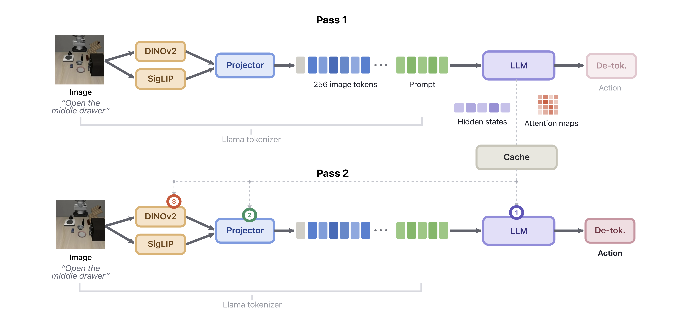
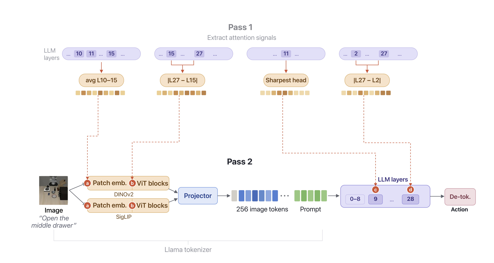
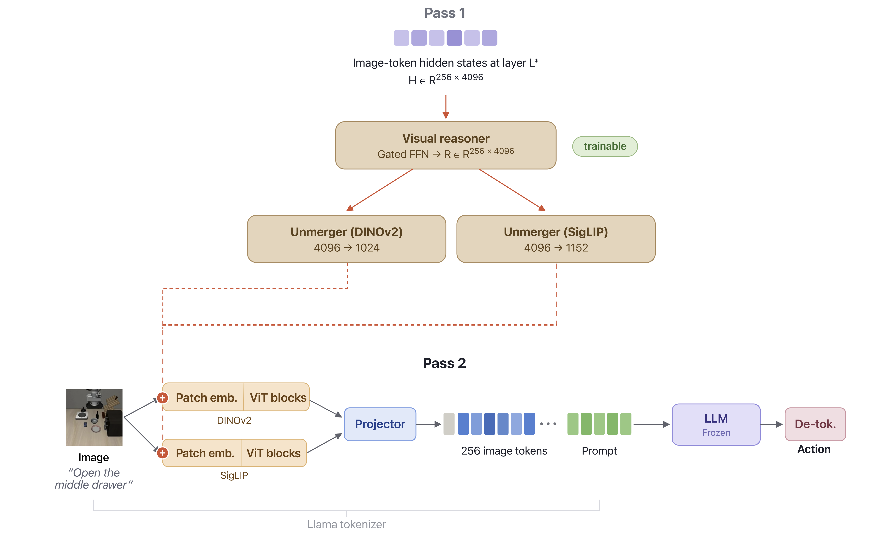
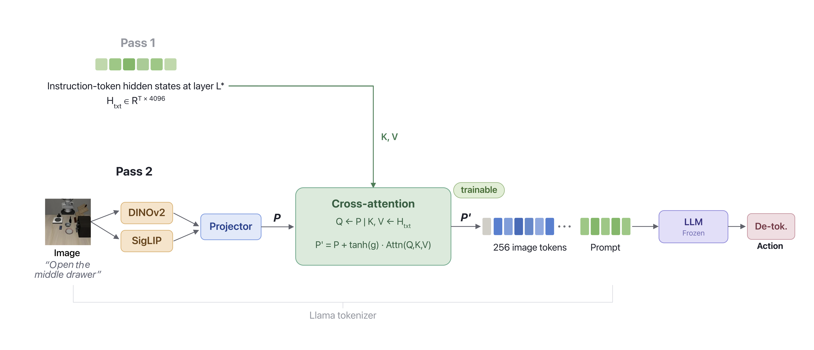
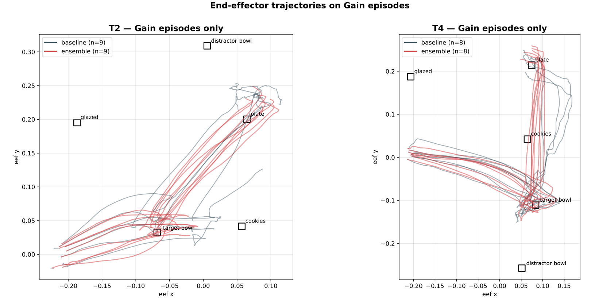
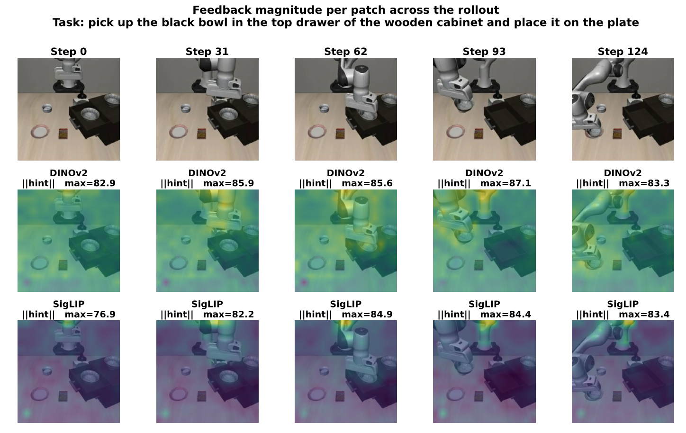
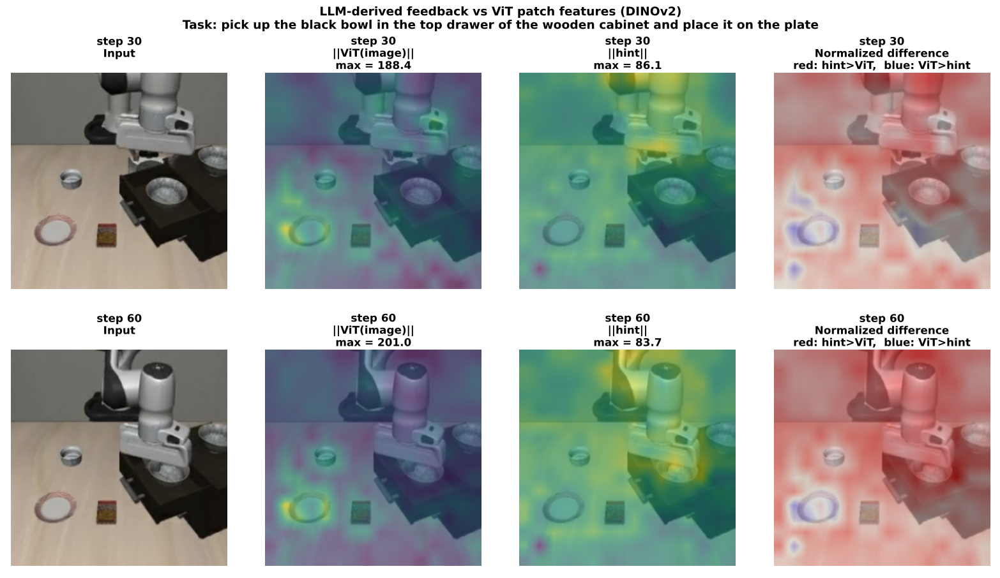

# Cross-Modal Reasoning in Vision-Language Models for Robotics

Three lightweight feedback mechanisms that let a Vision-Language-Action model
reuse its own LLM computation to refine action prediction. Built on OpenVLA,
evaluated on LIBERO and LIBERO-PRO.



## The three mechanisms

All three follow a two-pass scheme. Pass 1, run OpenVLA normally and cache
intermediate representations. Pass 2, use the cached representations to
modulate the visual features before action prediction.

The extraction layers used by each mechanism (L2, L7, L9, L10 to L15, L24,
L27, L28) were identified through the diagnostic analysis in
`diagnostic_analysis/`.

### Mechanism 1, Inference-Time Attention Modulation
Training-free. Attention weights from Pass 1 become a per-patch importance
mask that steers the model toward informative patches. Four variants, two
on the vision encoders and two inside the LLM.



### Mechanism 2, LLM-Guided Patch Modulation
Image-token hidden states from a chosen LLM layer are passed through a small
gated visual reasoner, mapped back to DINOv2 and SigLIP space by two
unmergers, and applied to the patch embeddings in one of three modes,
additive, gated, or FiLM.



### Mechanism 3, Projector Cross-Attention
Instruction-token hidden states from a chosen LLM layer are cross-attended
by the projected visual patches, gated by a single tanh scalar.



## Results

LIBERO-Spatial success rate.

| Configuration | Params | Success rate |
|---|---:|---:|
| OpenVLA baseline | 0 | 83.6 |
| Mechanism 1, residual scaling at L9 | 0 | 85.8 |
| Mechanism 3, layer 7 | 67 M | 86.2 |
| Mechanism 2, best additive | 160 M | 87.4 |
| Mechanism 2, best gated | 160 M | 88.0 |
| Ensemble of best additive and best gated | 320 M | **89.2** |

Ensemble transfer to other suites, mean of 3 seeds.

| Suite | Baseline | Ensemble |
|---|---:|---:|
| LIBERO-Spatial | 83.8 | **89.2** |
| LIBERO-Object | 87.8 | 85.2 |
| LIBERO-Goal | 76.8 | **81.0** |
| LIBERO-10 | 49.3 | **53.9** |
| Average | 74.4 | **77.3** |

Under LIBERO-PRO language perturbation, the ensemble raises the average
from 65.7 to 70.0. Under swap and task perturbations, both baseline and
ensemble collapse because the base model follows the memorised trajectory.

## Example

Task, "pick up the bowl in the top drawer of the wooden cabinet" (LIBERO-Spatial).
The baseline reaches the bowl but fails to close the gripper. The ensemble
completes the grasp and finishes the task.

| OpenVLA baseline, fails to grasp | Ensemble, completes the grasp |
|:---:|:---:|
|  |  |

## Analysis

**More consistent trajectories.** The ensemble (red) follows a direct,
repeatable route to the target bowl and then to the plate. The baseline
(grey) varies more between runs.



**The feedback tracks the end-effector.** Plotted as a heatmap over five
timesteps, the feedback concentrates on the manipulation region rather than
the background. On DINOv2 it follows the end-effector, on SigLIP it stays
fixed on the gripper. The feedback acts mainly through DINOv2.



**The feedback complements DINOv2.** DINOv2's features remain on the static
scene objects while the feedback concentrates on the end-effector. Red
regions in the difference map show where the feedback dominates. The
feedback adds action information that the encoder does not capture.



## Repository layout

```
mechanisms/                 the three feedback mechanisms
    attention_modulation/
    llm_guided_patch_modulation/
    projector_crossattention/
diagnostic_analysis/        code used to analyse OpenVLA layers
training/                   sbatch wrappers
eval/                       per-mechanism evaluation scripts
configs/eval_configs/       LIBERO-PRO perturbation configs
analysis/                   benchmarks, parameter counts, score aggregation
    visualizations/         thesis figure reproduction
```

## Setup

Linux with CUDA 12.1, one GPU with at least 40 GB memory, Python 3.10.

Two environments were used. `requirements.txt` is for evaluation and
reproduces the paper's environment (MuJoCo 2.3.7). `requirements-training.txt`
is for training the mechanisms.

For evaluation.

```
python3.10 -m venv venv_eval
source venv_eval/bin/activate
pip install --upgrade pip
pip install torch==2.2.0 torchvision==0.17.0 --index-url https://download.pytorch.org/whl/cu121
pip install -r requirements.txt
pip install flash-attn==2.5.5 --no-build-isolation
```

For training (only if you want to retrain Mechanism 2 or 3).

```
python3.10 -m venv venv_train
source venv_train/bin/activate
pip install --upgrade pip
pip install -r requirements-training.txt
```

If flash-attn install fails, skip it and pass `--use_flash_attention=False`
to eval scripts.

Clone the two companion repositories and install them in editable mode.

```
git clone https://github.com/katrmaria/openvla.git -b thesis-feedback
cd openvla && pip install -e . && cd ..

git clone https://github.com/katrmaria/LIBERO-PRO.git -b thesis-extended-perturbations
cd LIBERO-PRO/libero && pip install -e . && cd ../..
```

Set environment variables.

```
export DATA_ROOT_DIR=~/data/modified_libero_rlds
export MUJOCO_GL=egl
export PYOPENGL_PLATFORM=egl
export TOKENIZERS_PARALLELISM=false
export PYTHONPATH=$PWD:$PWD/../openvla:$PYTHONPATH
```

LIBERO RLDS data downloads automatically on first use from HuggingFace
`openvla/modified_libero_rlds`. Base OpenVLA checkpoints
(`openvla/openvla-7b-finetuned-libero-*`) download automatically on first
evaluation.

## Reproduction

### Baseline

```
python eval/baseline/run_libero_eval.py \
    --pretrained_checkpoint openvla/openvla-7b-finetuned-libero-spatial \
    --task_suite_name libero_spatial \
    --num_trials_per_task 50 --seed 7 --center_crop True
```

Expected 83.6.

### Mechanism 1, residual scaling at L9

```
python eval/attention_modulation/run_libero_eval_testtime_attnmod_v2.py \
    --base_model openvla/openvla-7b-finetuned-libero-spatial \
    --task_suite_name libero_spatial \
    --num_trials_per_task 50 --seed 7 \
    --variant residual_L9 --alpha 1.0
```

Expected 85.8.

### Mechanism 2, best gated (needs checkpoint)

```
python eval/llm_guided_patch_modulation/run_libero_eval_reason_vla.py \
    --base_model openvla/openvla-7b-finetuned-libero-spatial \
    --checkpoint_path checkpoints/gated_hl24_stage1.pth \
    --stage 1 --task_suite_name libero_spatial \
    --num_trials_per_task 50 --seed 7 \
    --hidden_layer 24 --feedback_mode gated
```

Expected 88.0.

### Mechanism 3, layer 7 (needs checkpoint)

```
python eval/projector_crossattention/run_libero_eval_reason_vla_projector_crossattn.py \
    --base_model openvla/openvla-7b-finetuned-libero-spatial \
    --checkpoint_path checkpoints/projcrossattn_hl7_stage1.pth \
    --stage 1 --task_suite_name libero_spatial \
    --num_trials_per_task 50 --seed 7 --hidden_layer 7
```

Expected 86.2.

### Ensemble

```
python eval/ensemble/run_libero_eval_reason_vla_ensemble.py \
    --base_model openvla/openvla-7b-finetuned-libero-spatial \
    --checkpoint_a checkpoints/additive_hl-1_stage2.pth \
    --checkpoint_b checkpoints/gated_hl24_stage1.pth \
    --hidden_layer_a -1 --feedback_mode_a additive --stage_a 2 \
    --hidden_layer_b 24 --feedback_mode_b gated --stage_b 1 \
    --task_suite_name libero_spatial \
    --num_trials_per_task 50 --seed 7
```

Expected 89.2.

### LIBERO-PRO

Add `EVAL_CONFIG=configs/eval_configs/eval_config_task.yaml` before the
command and switch to the `_patched.py` variant of the eval script.

### Other suites

Replace `libero_spatial` with `libero_object`, `libero_goal`, or `libero_10`,
and load the suite-specific checkpoint.

## Model weights

Not hosted here. Available on request.

## Citation

```
@mastersthesis{katranzopoulou2026crossmodal,
    title  = {Cross-Modal Reasoning in Vision-Language Models for Robotics},
    author = {Katranzopoulou, Maria},
    school = {Uppsala University},
    year   = {2026}
}
```

## License

MIT
